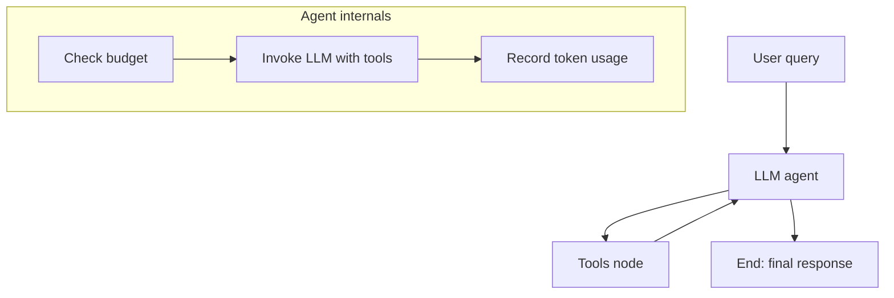

## LangGraph Agent Map

This diagram describes the current control flow implemented in `odds-agent/backend/server_py/graph.py`.

```mermaid
flowchart TD
  U[User query] --> A[LLM agent]
  A --> T[Tools node]
  T --> A
  A --> R[End: final response]

  subgraph Agent internals
    B1[Check budget] --> B2[Invoke LLM with tools]
    B2 --> B3[Record token usage]
  end
```

